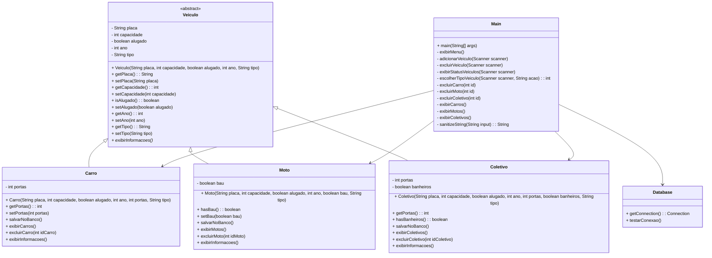

# 🚗 Vehicle Rental System

## 🧾 Capa e Identificação

- **Título do Projeto:** Sistema de Gerenciamento de Aluguel de Veículos  
- **Integrantes da Equipe:** Luigi Schmitt, Luís Aranha e Miguel Queiroz  
- **Cadeira:** Programação Orientada a Objetos  

---

## 📌 Introdução

O **Vehicle Rental System** é uma aplicação Java desenvolvida para gerenciar o cadastro e aluguel de diferentes tipos de veículos. O sistema foi concebido para atender a necessidade de empresas de locação de veículos que precisam manter um controle eficiente de sua frota, incluindo diferentes categorias de veículos, cada um com suas características específicas.

O problema abordado envolve a gestão de um catálogo diversificado de veículos disponíveis para aluguel, onde cada tipo de veículo possui atributos comuns (como placa e capacidade) e atributos específicos de sua categoria. A solução proposta permite cadastrar, excluir e visualizar os diferentes veículos, mantendo todas as informações organizadas em um banco de dados relacional.

### 🚘 Categorias de Veículos Atendidas

- **Carros**: com tipos específicos como SUV, Sedan e Hatch  
- **Motos**: incluindo variantes como Street e Scooter  
- **Coletivos**: abrangendo Van, Mini Van e Ônibus  

Essa abordagem facilita a expansão futura do sistema para incluir novas categorias ou atributos, mantendo a organização e a integridade dos dados.

---

## 🧠 Modelagem do Problema

A solução implementada segue os princípios da **Programação Orientada a Objetos**, estruturada da seguinte forma:

1. **🧬 Hierarquia de Classes**:
   - Uma classe base abstrata `Veiculo` que define os atributos e comportamentos comuns
   - Subclasses específicas `Carro`, `Moto` e `Coletivo` que herdam da classe base e implementam características específicas

2. **🔐 Encapsulamento**  
   Todas as classes implementam encapsulamento adequado com métodos getters e setters para acesso controlado aos atributos.

3. **🎭 Polimorfismo**
   - Polimorfismo estático: através de construtores e métodos sobrecarregados  
   - Polimorfismo dinâmico: através da implementação específica do método `salvarNoBanco()` em cada subclasse

4. **🧩 Interfaces e Classes Abstratas**  
   A classe base `Veiculo` implementa comportamentos abstratos que são especializados nas subclasses.

5. **📦 Collections**  
   Optamos por não utilizar diretamente as estruturas da API de Collections neste projeto. Em vez disso, adotamos um enfoque mais desafiador ao realizar a manipulação dos veículos por meio de interações com o banco de dados utilizando JDBC. Essa abordagem reforçou o nosso aprendizado sobre persistência de dados e simula com mais fidelidade o funcionamento de sistemas reais em produção.

6. **⚠️ Tratamento de Exceções**  
   Implementação de blocos `try-catch` para tratar erros de entrada de dados feita pelo usuário e falhas na comunicação com o banco de dados.

---

## 📊 Diagrama UML do Sistema de Aluguel de Veículos


---

## 🛠️ Ferramentas Utilizadas

### 💻 Ambiente de Desenvolvimento
- IDE: Visual Studio Code
- Sistema de Gerenciamento de Banco de Dados: PostgreSQL

### 📚 Bibliotecas e Frameworks Utilizados

- **JDBC (Java Database Connectivity)** – Utilizado para a comunicação com o banco de dados.
- **Driver JDBC para PostgreSQL** – Necessário para estabelecer a conexão entre a aplicação Java e o banco PostgreSQL.
- **Bibliotecas padrão do Java** – Como `Scanner` para entrada de dados via terminal e tratamento de exceções com `SQLException`.

---

### 🗂️ Estrutura de Pacotes
```
src/
├── main/
│ ├── java/
│ │ ├── Main.java
│ │ ├── models/
│ │ │ ├── Veiculo.java
│ │ │ ├── Carro.java
│ │ │ ├── Moto.java
│ │ │ ├── Coletivo.java
│ │ │ └── Database.java
```

📌 O projeto está organizado em pacotes que separam a lógica principal da aplicação (`Main.java`) dos modelos de dados (pacote `models`).  
Essa estrutura facilita a manutenção e a escalabilidade do sistema, permitindo a adição de novos tipos de veículos ou funcionalidades com alterações mínimas no código existente.

---

## ✅ Resultados e Considerações Finais

O **Sistema de Gerenciamento de Aluguel de Veículos** atende plenamente aos requisitos propostos, oferecendo uma interface de terminal intuitiva para o controle da frota disponível para locação. A aplicação possibilita:

1. Cadastrar novos veículos com seus atributos específicos  
2. Excluir veículos do sistema por ID  
3. Visualizar todos os veículos cadastrados, organizados por categoria  

💾 A integração com o banco de dados PostgreSQL garante a persistência das informações e permite a expansão futura do sistema com funcionalidades como:

- Controle de clientes
- Gestão de contratos de aluguel
- Histórico de manutenções

---

### ⚠️ Dificuldades Encontradas

Durante o desenvolvimento, enfrentamos os seguintes desafios:

1. Implementação da conexão com o banco de dados e tratamento adequado de exceções
2. Modelagem da hierarquia de classes para evitar duplicação de código
3. Validação das entradas do usuário para prevenir erros

---

### 🎓 Aprendizagens e Reflexões

Este projeto proporcionou um aprofundamento prático dos principais conceitos de **Programação Orientada a Objetos**, com ênfase em:

- 🧬 Herança
- 🎭 Polimorfismo
- 🔐 Encapsulamento

A experiência com **persistência de dados via JDBC** também foi essencial, evidenciando a importância de um design robusto de banco de dados para sustentar a estrutura do sistema.  

Além disso, a aplicação do paradigma OO demonstrou ser especialmente eficaz para modelar a hierarquia de veículos, tornando o código mais organizado e extensível.

---

### 🌟 Sugestões para Melhorias Futuras

1. Implementar uma interface gráfica com JavaFX ou Swing  
2. Adicionar funcionalidades de busca e filtragem de veículos  
3. Criar um módulo de relatórios para análise da frota  
4. Desenvolver um sistema de autenticação para controle de acesso

---

### 👨‍🏫 Feedback sobre a Disciplina

A disciplina de **Programação Orientada a Objetos** forneceu uma base sólida para o desenvolvimento do projeto.  
Os conceitos discutidos em sala de aula, aliando teoria e prática, foram fundamentais para estruturar o código de forma clara, coesa e alinhada com boas práticas de desenvolvimento de software.
